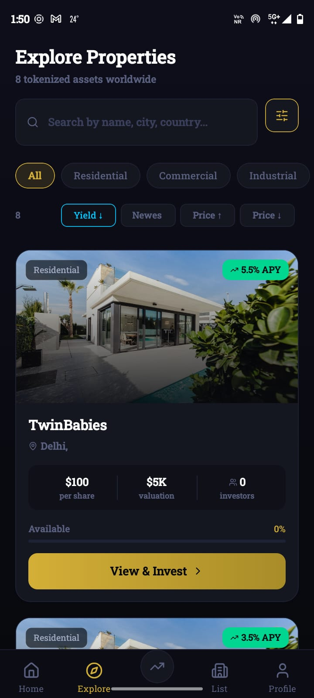
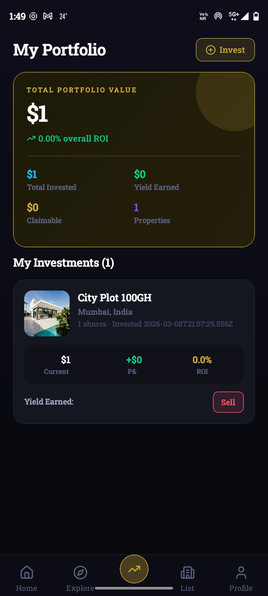
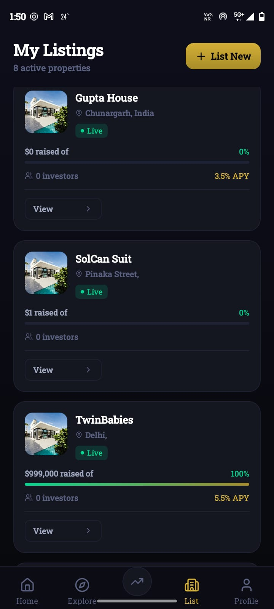

# Aeternum


Mobile-first real estate tokenization app built with Expo + React Native + TypeScript.

This app supports:

- Wallet-based onboarding (Solana Mobile Wallet Adapter)
- Property discovery and filtering
- Fractional buy/sell flows
- Yield claiming flow
- Listing draft workflow (multi-step)

## PDF Preview

- Open the PDF: [`aeternum.pdf`](./aeternum.pdf)

<object data="./aeternum.pdf" type="application/pdf" width="100%" height="700">
  <p>
    Your Markdown viewer does not support inline PDF preview.
    Open it here: <a href="./aeternum.pdf">aeternum.pdf</a>
  </p>
</object>

## App Preview

### Mobile Preview (1, 2, 3)






## Backend Link
[Solana Backend Repository](https://github.com/ag21o9/SolanaBackend)

## Table Of Contents

1. Overview
2. Tech Stack
3. Project Structure
4. Environment Variables
5. Getting Started
6. Run Scripts
7. App Routing Map
8. Architecture And Data Flow
9. API Integration Catalog
10. Wallet And Auth Flow
11. Listing Draft Flow
12. Solana Transaction Flow
13. Error Handling Strategy
14. Troubleshooting
15. Notes For Contributors

## 1. Overview

`Aeternum Real` is a React Native app that lets users:

- Connect a Solana wallet
- Complete account setup
- Browse tokenized properties
- Buy and sell fractional shares
- Track portfolio and claim yield
- Create and submit property listing drafts

The app uses a backend API for business data and transaction orchestration, with client-side signing done through mobile wallet adapters.

## 2. Tech Stack

- `Expo` + `React Native` + `TypeScript`
- `expo-router` for file-based routing
- `@tanstack/react-query` for server state and cache invalidation
- `zustand` for persisted wallet session/auth state
- `@react-native-async-storage/async-storage` for local persistence
- `@solana/web3.js` + Solana Mobile Wallet Adapter for signing/broadcast flows

Key package references:

- `package.json`
- `app.json`

## 3. Project Structure

Core directories:

- `app/`: screen routes (Expo Router)
- `context/`: shared context (`WalletContext`) and app-wide wallet/session logic
- `services/`: backend API clients and request/response mapping
- `stores/`: Zustand stores (wallet and listing draft state)
- `types/`: shared app-level TypeScript types
- `mocks/`: static fallback/mock values used in selected UI paths
- `constants/`: app constants (colors, etc.)
- `assets/`: images and static assets

Important files:

- `services/api.ts`: central API wrapper (`apiRequest`) with auth header injection
- `context/WalletContext.tsx`: wallet connect, setup, portfolio, claim flow, derived totals
- `app/connect.tsx`: connect/signin/setup routing decision logic
- `services/transactions.ts`: quote/initiate/confirm buy-sell endpoints
- `services/investments.ts`: `/api/investments/me` integration and mapping
- `services/yield.ts`: claimable/initiate/confirm yield endpoints
- `services/listingDraft.ts`: listing draft create/update/submit/upload/mint endpoints
- `services/property.ts`: property listing/feed and my-listings mapping

## 4. Environment Variables

The app currently supports these runtime env vars:

- `EXPO_PUBLIC_BACKEND_BASE_URL`
- `EXPO_PUBLIC_SOLANA_DEVNET_RPC_URL`
- `EXPO_PUBLIC_SOLANA_DEVNET_RPC_FALLBACKS`
- `EXPO_PUBLIC_SOLANA_MAINNET_RPC_URL`
- `EXPO_PUBLIC_SOLANA_MAINNET_RPC_FALLBACKS`

Notes:

- `services/api.ts` currently has a hardcoded `BACKEND_BASE_URL` constant. Some screens (for example `app/connect.tsx`) already read `EXPO_PUBLIC_BACKEND_BASE_URL` with fallback.
- Use comma-separated values for fallback RPC lists.

Example `.env` values:

```bash
EXPO_PUBLIC_BACKEND_BASE_URL=https://y-lake-five.vercel.app
EXPO_PUBLIC_SOLANA_DEVNET_RPC_URL=https://api.devnet.solana.com
EXPO_PUBLIC_SOLANA_DEVNET_RPC_FALLBACKS=https://rpc.ankr.com/solana_devnet,https://solana-devnet.g.alchemy.com/v2/<key>
EXPO_PUBLIC_SOLANA_MAINNET_RPC_URL=https://api.mainnet-beta.solana.com
EXPO_PUBLIC_SOLANA_MAINNET_RPC_FALLBACKS=https://rpc.ankr.com/solana,https://solana-mainnet.g.alchemy.com/v2/<key>
```

## 5. Getting Started

Prerequisites:

- Node.js 18+
- npm (or yarn/pnpm if you adapt scripts)
- Expo CLI (via `npx expo` is enough)
- Android device/emulator for wallet flows
- A Solana wallet app supporting Mobile Wallet Adapter (for example Phantom/Solflare mobile)

Install dependencies:

```bash
npm install
```

Start Expo:

```bash
npm run start
```

For web preview:

```bash
npm run start-web
```

## 6. Run Scripts

Defined in `package.json`:

- `npm run start`: start Expo dev server
- `npm run start-web`: start Expo for web
- `npm run lint`: run Expo lint

## 7. App Routing Map

Top-level routes from `app/`:

- `/` -> entry/index screen
- `/connect` -> wallet selection and connection
- `/setup` -> user setup/onboarding
- `/claim` -> claim UI
- `/settings` -> app/user settings

Tabs (`app/(tabs)`):

- `/(tabs)/home`
- `/(tabs)/explore`
- `/(tabs)/investments`
- `/(tabs)/listings`
- `/(tabs)/profile`

Dynamic/detail routes:

- `/property/[id]`
- `/buy/[id]`
- `/sell/[id]`
- `/list/draft/[id]`

Listing creation flow:

- `/list/step1`
- `/list/step2`
- `/list/step3`
- `/list/review`

## 8. Architecture And Data Flow

### UI Layer

Screen components under `app/` render views and user interactions.

### State Layer

- `WalletContext` (context): high-level app state and actions
- Zustand store (`stores/wallet-store.ts`): persisted wallet metadata, auth token, network mode
- React Query: server data fetching, retries, cache + invalidation

### Service Layer

`services/*` files encapsulate backend contracts and map backend payloads to app-friendly types.

### Data Flow Pattern

Typical request pattern:

1. Screen/action triggers context method or service function.
2. Service uses `apiRequest` in `services/api.ts`.
3. `apiRequest` injects bearer token when `requiresAuth` is true.
4. Response is parsed and normalized (especially numeric values).
5. React Query cache updates and dependent screens re-render.

## 9. API Integration Catalog

All endpoint paths below reflect current service code.

### Authentication / User

- `GET /by-wallet/:walletAddress` (fallback: `GET /user/by-wallet/:walletAddress`) in `app/connect.tsx`
- `POST /user/signin` in `app/connect.tsx`
- `GET /user/profile` in `services/userProfile.ts`

### Properties

- `GET /property/properties?page=&limit=` in `services/property.ts`
- `GET /property/properties/my-listings?page=&limit=` in `services/property.ts`

### Investments / Portfolio

- `GET /api/investments/me` in `services/investments.ts`
- `GET /api/investments/:propertyId/sell-quote?shares=&walletAddress=` in `services/transactions.ts`

### Transactions

- `GET /api/properties/:propertyId/quote?shares=` in `services/transactions.ts`
- `POST /api/transactions/initiate-buy` in `services/transactions.ts`
- `POST /api/transactions/initiate-sell` in `services/transactions.ts`
- `POST /api/transactions/confirm` in `services/transactions.ts`

### Yield

- `GET /api/yield/claimable?wallet=` in `services/yield.ts`
- `POST /api/yield/claim` in `services/yield.ts`
- `POST /api/yield/confirm-claim` in `services/yield.ts`

### Listing Drafts

- `POST /property/listings/draft` (step 1 create)
- `PATCH /property/listings/:draftId` (step updates)
- `POST /property/listings/:draftId/submit`
- `GET /property/listings/drafts?page=&limit=`
- `GET /property/listings/drafts/:draftId`
- `POST /property/upload/image`
- `POST /property/mint/property`

All draft endpoints are implemented in `services/listingDraft.ts`.

## 10. Wallet And Auth Flow

Main logic lives in `app/connect.tsx` and `context/WalletContext.tsx`.

Connection/signin sequence:

1. User selects wallet in `/connect`.
2. App calls wallet `authorize` through mobile wallet adapter.
3. Wallet public key is decoded and persisted in Zustand + AsyncStorage session keys.
4. App checks existing user with `/by-wallet/:address` (with fallback path).
5. If backend says no user (`exists=false`, `message=no user`), app routes to `/setup`.
6. Otherwise app signs a login message and calls `POST /user/signin`.
7. Backend token is saved to AsyncStorage (`aeturnum_backend_token`).
8. User is routed to `/(tabs)/home`.

Token usage:

- `services/api.ts` injects `Authorization: Bearer <token>` automatically for auth-required requests.

## 11. Listing Draft Flow

The list flow is multi-step and backend-driven.

### Step 1

Creates a draft with basic property info:

- `name`, `type`, `country`, `city`, `addressFull`, `description`, `yearBuilt`, `areaSqft`

### Step 2

Tokenomics payload supports:

- `tokenModel`
- `totalValuation`
- `pricePerShare`
- `totalShares`
- `availableShares`
- `yieldPercent`
- `monthlyRental`
- `operatingCosts`
- `managementFeePct`
- `insuranceCost`
- `capRate`
- `occupancyPct`

### Step 3

Media/doc references:

- `coverImageUrl`
- `images[]`
- `videoUrl`

### Step 4 and Submit

Legal docs and final submission:

- `titleDeedUrl`
- `ownershipProofUrl`
- `complianceCertificateUrl`

Then submit draft and optionally mint property via `/property/mint/property`.

## 12. Solana Transaction Flow

Implemented across `context/WalletContext.tsx`, `services/transactions.ts`, and `services/yield.ts`.

High-level pattern:

1. Backend returns an `unsignedTx` (base64).
2. App deserializes to `VersionedTransaction`.
3. App requests wallet signing (or sign+send when available).
4. If wallet does not submit directly, app broadcasts via `@solana/web3.js`.
5. App confirms signature and reports to backend confirm endpoint.

RPC fallback:

- For claim flow, the app cycles through configured RPC endpoints (`EXPO_PUBLIC_SOLANA_*` + defaults).

## 13. Error Handling Strategy

### API Layer

- `ApiError` includes `status` and `data`.
- Network failures are surfaced as status `0`.
- Non-2xx responses parse backend message when available.

### Retry Patterns

- `confirmTransaction` retries network-only failures (`status === 0`).
- Connect by-wallet checks use retry and path fallback.

### Numeric Normalization

Backend numeric fields can arrive as `number | string | null` (and property feed may include Prisma decimal JSON). Service mappers normalize before UI rendering to avoid runtime errors.

## 14. Troubleshooting

### Wallet connection fails

- Ensure wallet app is installed on device.
- Ensure the wallet supports Solana Mobile Wallet Adapter.
- Check deep linking and app permissions on Android.

### Signin works but API calls fail with auth error

- Verify token exists under key `aeturnum_backend_token` in AsyncStorage.
- Reconnect/sign in again to refresh token.

### Confirm transaction intermittently fails

- This can happen when app focus/network changes after returning from wallet app.
- Current implementation retries network-level failures; if still failing, verify backend availability and mobile network stability.

### Claim transaction broadcast fails

- Verify RPC env vars and fallback list format.
- Ensure selected network mode matches funded wallet network.

### Images or property media missing

- Check upload endpoint response shape in `services/listingDraft.ts`.
- Verify backend returns one of supported URL fields (`url`, `imageUrl`, `fileUrl`, nested `data.url`).

## 15. Notes For Contributors

- Keep API logic centralized in `services/*` and avoid inline `fetch` inside random screens.
- Prefer adding endpoint wrappers to `services/api.ts` usage pattern instead of duplicating auth logic.
- For any new backend numeric fields, normalize in service mappers before exposing to UI.
- When adding transactional flows, include:
  - unsigned transaction deserialize
  - signing path for wallet capabilities
  - backend confirm call
  - React Query invalidation hooks for affected data.

---

If you want, this README can be further extended with:

1. Screen-by-screen UI documentation with screenshots.
2. Sequence diagrams for buy/sell/claim and listing submission.
3. A backend contract appendix with request/response examples for each endpoint.
